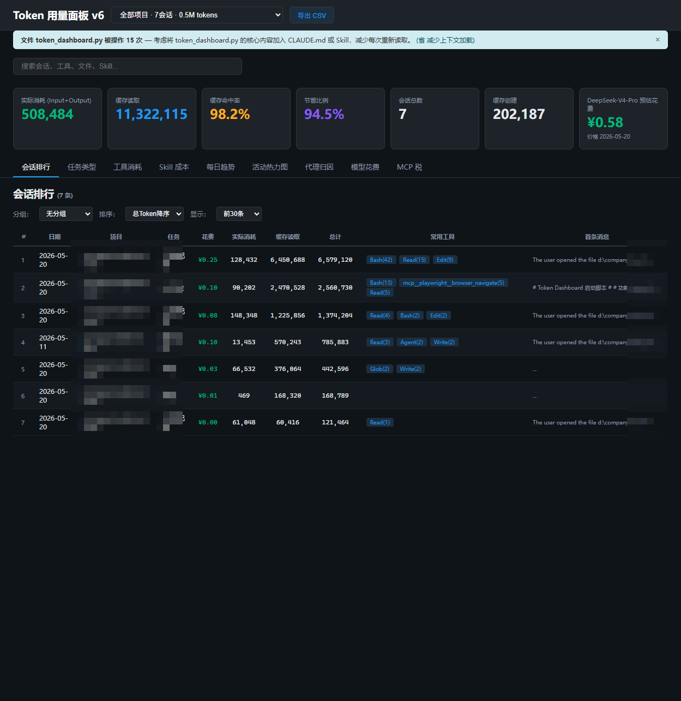
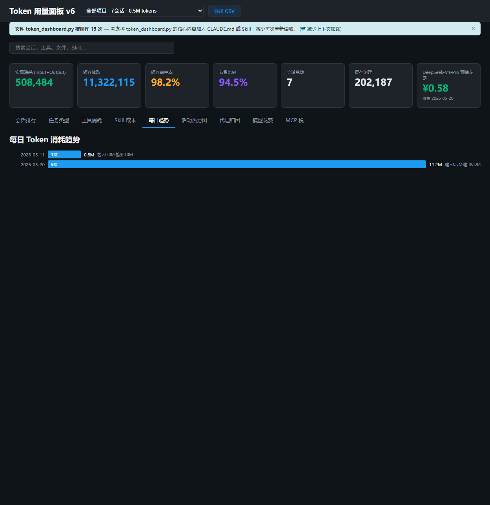
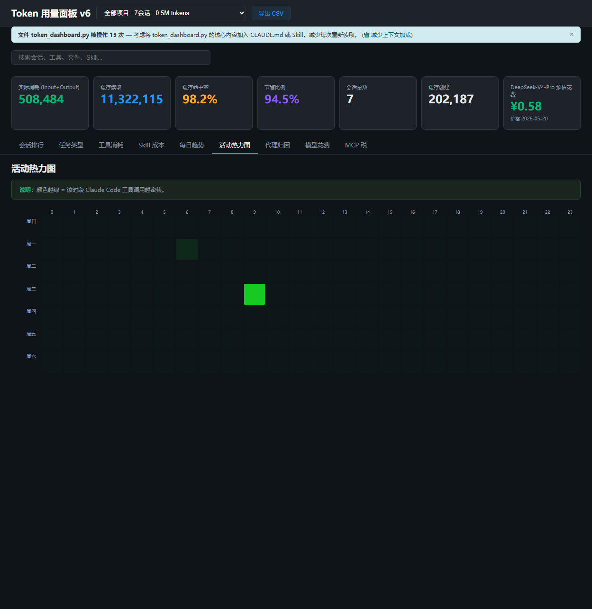
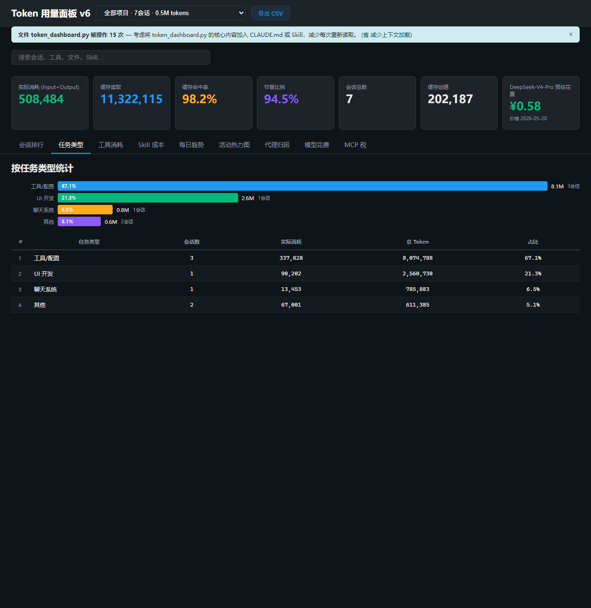
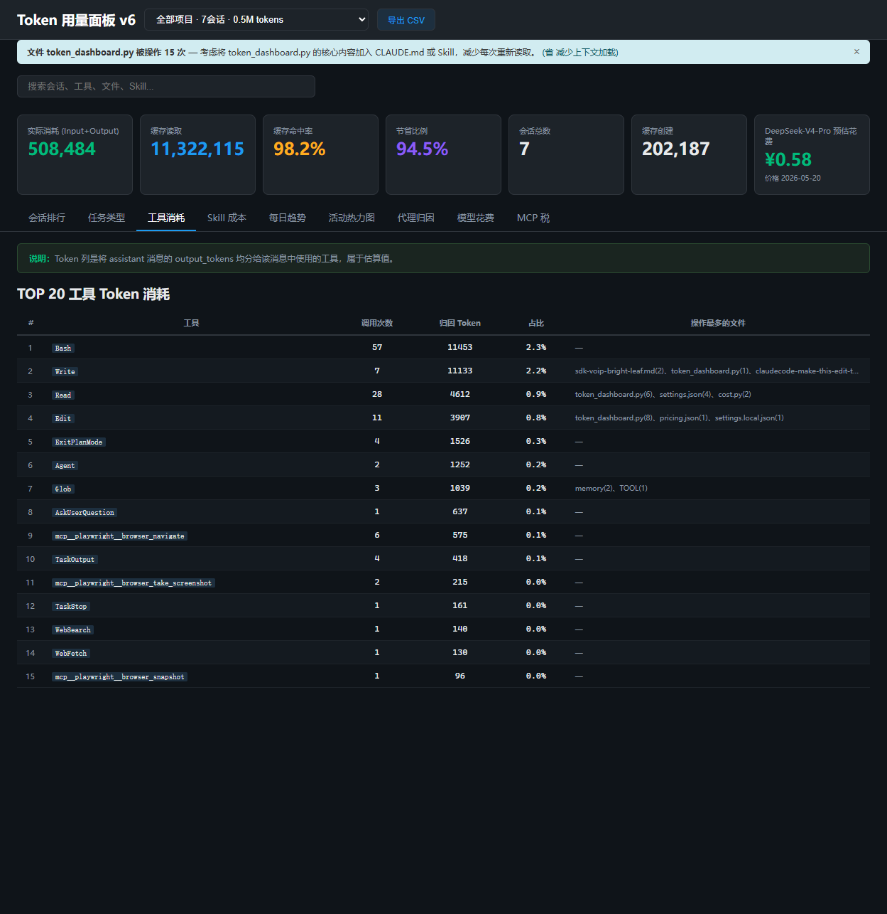

# Claude Code Token Dashboard

本地运行的 Claude Code Token 用量可视化面板。读取 Claude Code 自动保存的 JSONL 会话记录，生成交互式 HTML 报告。

- **零配置**：无需安装 Python 环境，只需有 [uv](https://docs.astral.sh/uv/)
- **一键启动**：双击 `run.bat`
- **数据本地**：不上传任何服务器
- **跨平台**：Windows / macOS / Linux 均可用

## 功能预览

启动后自动打开浏览器，顶部卡片展示全局汇总，下方提供 9 个分析维度：



顶部汇总卡片从左到右依次为：

| 指标 | 说明 |
|------|------|
| 实际消耗 | 真正的 Input + Output token 数（扣除了缓存命中） |
| 缓存读取 | 从 Anthropic prompt cache 命中读取的 token 数 |
| 缓存命中率 | `缓存读取 / (缓存读取 + 实际消耗)` — 越高越省钱 |
| 节省比例 | 因缓存命中而省掉的 Input token 百分比 |
| 会话总数 | 该面板覆盖的会话数量 |
| 缓存创建 | 写入缓存的新 token 数（上下文加载消耗） |
| 预估花费 | 基于 `pricing.json` 中模型单价计算的人民币金额 |

## 快速开始

### 前置条件

安装 [uv](https://docs.astral.sh/uv/getting-started/installation/)（Python 包管理器，无需提前安装 Python）。

打开终端，粘贴对应命令运行：

```bash
# Windows（在 PowerShell 中运行）
powershell -ExecutionPolicy ByPass -c "irm https://astral.sh/uv/install.ps1 | iex"

# macOS / Linux（在 Terminal 中运行）
curl -LsSf https://astral.sh/uv/install.sh | sh
```

### 启动

**Windows**：双击 `run.bat`，自动打开浏览器。

**macOS / Linux**：

```bash
uv run token_dashboard.py
```

首次运行会扫描 `~/.claude/projects/` 下所有 JSONL 文件（可能需要几秒），之后生成 HTML、启动 HTTP 服务、自动打开浏览器。

按 `Ctrl+C` 停止服务。

## 9 个分析维度

### 1. 会话排行（默认视图）

按项目/日期/任务类型分组，支持搜索、排序、CSV 导出。每行显示一次会话的花费、实际消耗、缓存读取、常用工具和首条消息摘要。点击表头可排序，上方下拉框支持分组聚合和 Top N 筛选。

### 2. 每日趋势

按天统计 token 消耗曲线，直观看到哪些天用量最高、缓存效率变化趋势：



### 3. 活动热力图

24 小时 × 7 天的方格热力图，展示你的工作时段分布。颜色越深代表该时段 token 消耗越多，适合用来分析编码习惯和 AI 使用高峰：



### 4. 任务类型

自动将每次会话归类为 12 种任务类型之一（Push SDK、Bug 修复、UI 开发、工具/配置、聊天系统等），按类型汇总花费和 token 消耗，帮助定位哪个环节成本最高。



### 5. 工具消耗

统计每个工具（Bash、Read、Edit、Agent、Glob 等）的调用次数和估算 token 消耗，帮助发现哪些操作最"吃"token：



### 6. Skill 成本

各 Skill 的上下文大小分析，展示哪些 Skill 占用了最多的系统提示词空间，帮你精简 SKILL.md。

### 7. 代理归因

Explore / Plan 等子代理的花费归因，区分主代理和子代理各自的 token 消耗。

### 8. 模型花费

各模型的消息数量占比和估算金额，支持多模型切换对比。

### 9. MCP 税

MCP 服务端指令占用的上下文常驻开销。每次请求都会携带这些指令，量化它们的 token 成本。

### 省钱建议引擎

4 类自动检测规则，在面板顶部以黄色提示条展示：

- **缓存纪律**：频繁操作同一文件但未充分利用缓存
- **重复文件**：同一文件在多次对话中被反复读取
- **模型降级**：简单任务用了昂贵模型
- **结果过大**：工具返回数据量过大浪费上下文

点击 × 可关闭单条建议（14 天内不再显示）。

## 工作原理

```
双击 run.bat（或 uv run token_dashboard.py）
  │
  ├─ 1. 扫描 ~/.claude/projects/ 下所有子目录的 .jsonl 文件
  │     ├─ 首次：全量解析 → 写入 SQLite 缓存
  │     └─ 后续：按文件修改时间增量更新
  │
  ├─ 2. 数据聚合 + 花费计算 + 省钱建议
  │
  ├─ 3. 生成 token_dashboard.html（内嵌全部数据和 JS）
  │
  └─ 4. 启动 HTTP Server → 自动打开浏览器
```

**数据来源**：Claude Code 在 `~/.claude/projects/<project-hash>/` 下自动保存每次对话的 `.jsonl` 文件，包含每轮对话的模型名、token 用量、工具调用和费用信息。本工具扫描所有这些文件进行聚合分析。

**增量更新**：首次扫描后生成 `token_cache.db`（SQLite），后续启动只检查文件修改时间，仅解析新增或变更的 JSONL 文件，秒级启动。

> `run.bat` 每次启动会自动清除缓存，保证数据始终最新。

**离线可用**：生成的 `token_dashboard.html` 是纯静态文件，内嵌全部数据和 Chart.js，不依赖后端服务。可以拷贝到任何有浏览器的机器上直接打开。

## 换台电脑也能用

只要那台电脑上也用过 Claude Code（有 `~/.claude/projects/` 目录），把项目文件夹复制过去，双击 `run.bat`（Windows）或运行 `uv run token_dashboard.py`（macOS / Linux）即可。

## 配置模型价格

编辑 `pricing.json`，单位为**人民币 / 百万 token**：

```json
{
  "DeepSeek-V4-Pro":   {"input": 3.0,  "output": 6.0,  "cache_read": 0.025},
  "DeepSeek-V4-Flash": {"input": 1.0,  "output": 2.0,  "cache_read": 0.02},
  "claude-sonnet-4-6": {"input": 6.0,  "output": 12.0, "cache_read": 0.05}
}
```

- 计费公式：`(输入 - 缓存命中) / 1M × 输入价 + 输出 / 1M × 输出价 + 缓存命中 / 1M × 缓存命中价`
- 模型名不区分大小写
- 修改后重启即生效

## 修改端口

编辑 `token_dashboard.py` 中的 `PORT` 变量（默认 8766）。

## 项目结构

```
token-dashboard/
├── token_dashboard.py    # 入口：HTTP 服务器 + 流程编排
├── scanner.py            # JSONL 解析 + SQLite 缓存 + 消息去重
├── cost.py               # 多模型定价 + 花费计算
├── analytics.py          # 省钱建议引擎 + 数据聚合
├── dashboard_html.py     # HTML 生成器（内嵌全部数据）
├── pricing.json          # 模型定价配置
├── run.bat               # Windows 一键启动脚本
├── screenshots/          # 界面截图
└── README.md
```

## 常见问题

**Q: 启动后数据全是 0？**  
A: 确认 `~/.claude/projects/` 目录下有子目录且包含 `.jsonl` 文件。该目录由 Claude Code 自动创建，使用过 Claude Code 才会有数据。

**Q: 花费金额不准确？**  
A: 编辑 `pricing.json`，填入你实际使用的 API 渠道价格。不同渠道价格差异较大。

**Q: 修改价格后金额没变？**  
A: 删除 `token_cache.db` 重新扫描（或直接双击 `run.bat`，它会自动清除缓存）。

**Q: 端口被占用？**  
A: 修改 `token_dashboard.py` 中的 `PORT` 变量。

**Q: macOS / Linux 怎么用？**  
A: 安装 uv 后运行 `uv run token_dashboard.py`，效果与 Windows 相同。

## License

MIT
